  

  <h3 align="center">ZebraWoo(Matrix Woo)</h3>

  

    <samp>
      <a href="https://ZebraWoo.github.io">Homepage</a> &middot;
      <a href="mailto:woomatrix9@gmail.com">Email</a>
    </samp>
  

  

    🔬 关于我
  

  - 喜欢折腾代码，热衷于 **AI 4 Healthcare**
  - 业余游戏玩家，偶尔写点前端看板来自动化日常任务
  - 常用工具链：Python、Git、Obsidian

  

    🛠 技术栈 (Skills)
  

  - ⚡ **AI/Frameworks:** PyTorch, Spiking Neural Networks
  - ⚡ **Backend:** Python, C++

  

    📧 联系我
  

  - [woomatrix9@gmail.com](mailto:woomatrix9@gmail.com)

